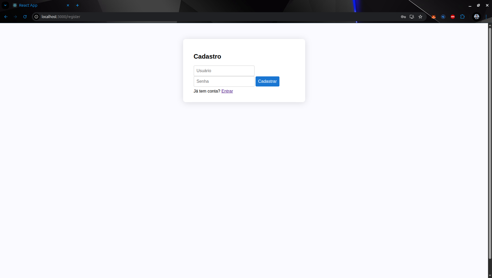
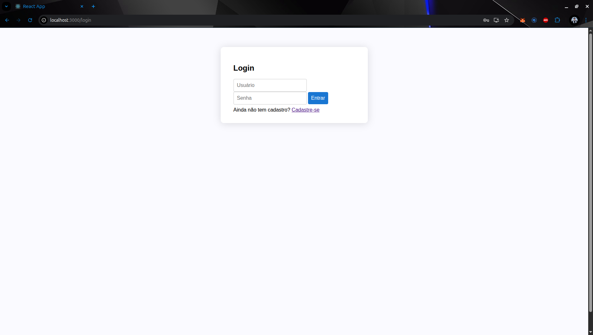
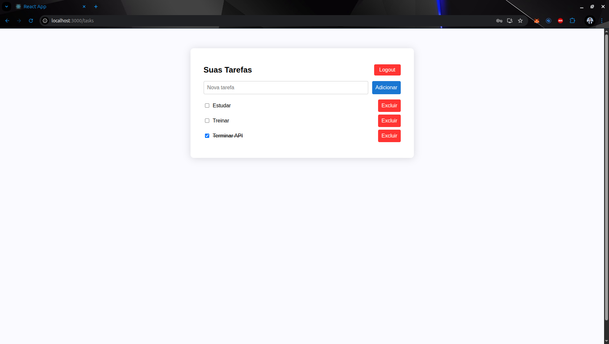

# ToDo Frontend

Interface web moderna para gerenciar tarefas, desenvolvida em **React** com Material UI para um visual profissional (inspirado em apps como Trello/Notion/Google Tasks).

---

## Features

- Login e cadastro com autenticação JWT  
- CRUD completo de tarefas  
- Interface moderna com Material UI  
- Validação de formulários e mensagens de erro amigáveis  
- Integração fácil com backend Node/Express/MongoDB  

---

## Pré-requisitos

- Node.js 16+ (preferencialmente 18+)
- Backend rodando ([ToDo-backend](https://github.com/seu-usuario/ToDo-backend)), configure a URL da API se necessário

---

## Instalação

```bash
git clone https://github.com/TiagoFerreira4/ToDo-frontend.git
cd ToDo-frontend
npm install
```

---

## Rodando localmente

Antes de tudo, suba o backend em outra aba/terminal.

```bash
npm start
```

O app abrirá automaticamente em [http://localhost:3000](http://localhost:3000).

---

## Configuração

Por padrão, as requisições vão para `http://localhost:5000`.  
Se seu backend estiver em outro endereço/porta, edite o arquivo `src/api.js`.

---

## Tecnologias usadas

- React  
- Material UI  
- Axios  
- React Router DOM  

---

## Screenshots

  
  
  

---

## Contribuindo

Pull requests são bem-vindos!  
Para contribuições, abra uma issue ou fork o projeto.

---
